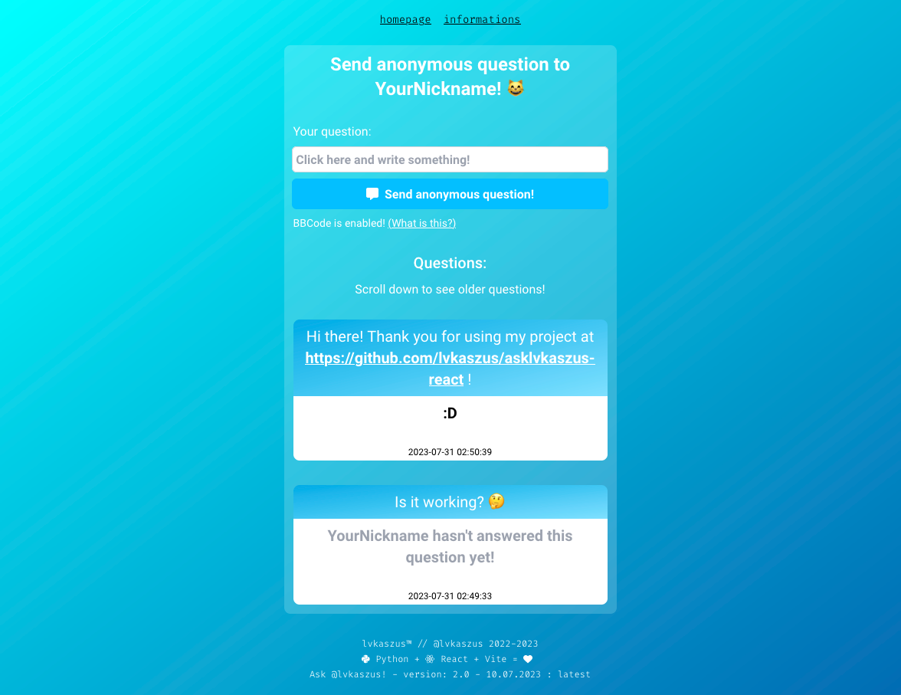
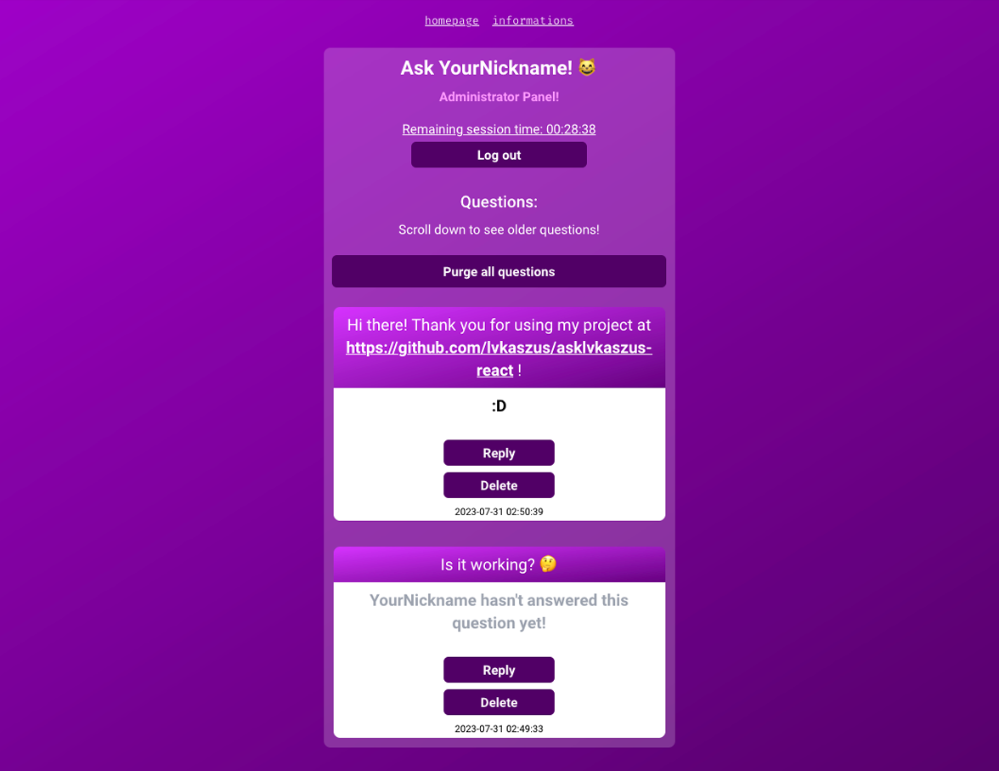

# ⚠️ Important warning!

Please DO NOT! install this application version (2.xx) on your server anymore because it is replaced with newer version (3.xx)! Downgrading from version 3.xx to version 2.xx is not compatible because of breaking changes inside application structure. Please DO! install latest version of this application to avoid problems and security issues!

## Ask @lvkaszus! - Python + React

- Anonymous questions and answers pretty much like <a href="https://ngl.link">NGL App</a> or <a href="https://tellonym.me/">Tellonym</a>, with Backend written in Python, very simple user interface, support for i18n and also BBCode!

  
  

⚠️ WARNING! - You must have domain name and SSL/TLS certificate to use this application without any modifications to the source code! This is needed for your security. ⚠️

### Why this was created?

I pretty much like the conception of <a href="https://ngl.link">NGL App</a> or <a href="https://tellonym.me/">Tellonym</a>, but I didn't like overall application operation. So, I created my own alternative to them with some added features and no analytics inside source code.

### Features
- You can change nickname viewed on Frontend and Backend from "@lvkaszus" to for example "@MyNickname"
  
- Separated Backend, Frontend and Admin Panel
  
- i18n support for internationalization
  
- BBCode support for bold, italic and underlined text but also with YouTube video embed support and Map Location embed by OpenStreetMap (currently by `dangerouslySetInnerHTML` and sanitization in backend, but this will change in next release)
  
- Rate-limiting by Flask-Limiter and Redis
  
- Database powered by MariaDB
  
- Admin Panel with options like deleting all questions, replying to questions and also deleting single questions
  
- Very basic authentication system by using API Auth Key specified by you during installation of Backend of this App and Cookies with expiration time of 30 minutes by default
  

### Installation

If you want to deploy this project on your own server, you have two options:

- Installing with Docker
- Installing without Docker
  
Open and read `Installation.md` file in the `Documentation` folder for Installation steps.</a>

### Common problems

If you experience any problems after installation, feel free to open and read `Common problems after installation.md` file in the `Documentation` folder!

### Full documentation

You can read full documentation of this project in the `Documentation` folder.

### Do you want to contribute?

If you want to add new feature to this project or improve something, you can contribute without any problems!

### Credits
- This project uses Python libraries like Flask, Flask-Limiter, Flask-CORS, mysql-connector-python, bleach and others. 
- This project uses React library. (https://github.com/facebook/react)
- This project uses Vite library. (https://github.com/vitejs/vite)
- This project uses Axios library. (https://github.com/axios/axios)
- This project uses i18n for React library. (https://github.com/i18next/react-i18next)
- This project uses Font Awesome for React library. (https://github.com/FortAwesome/react-fontawesome)
- This project uses Fira Code font. (https://github.com/tonsky/FiraCode)
