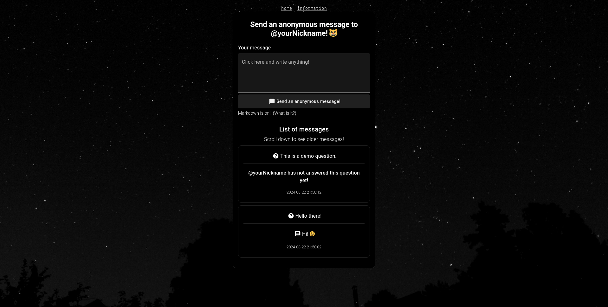
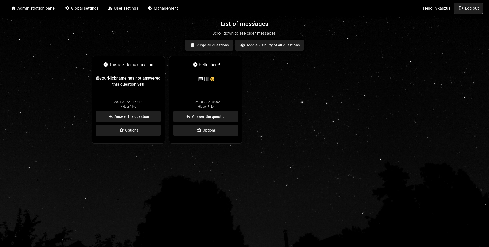
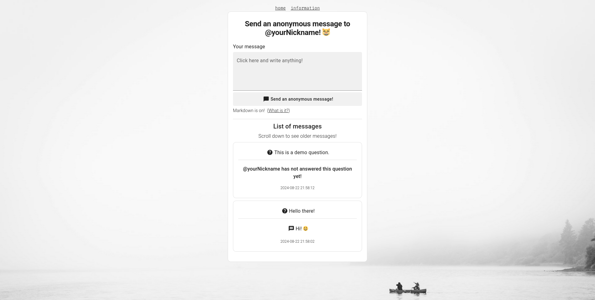
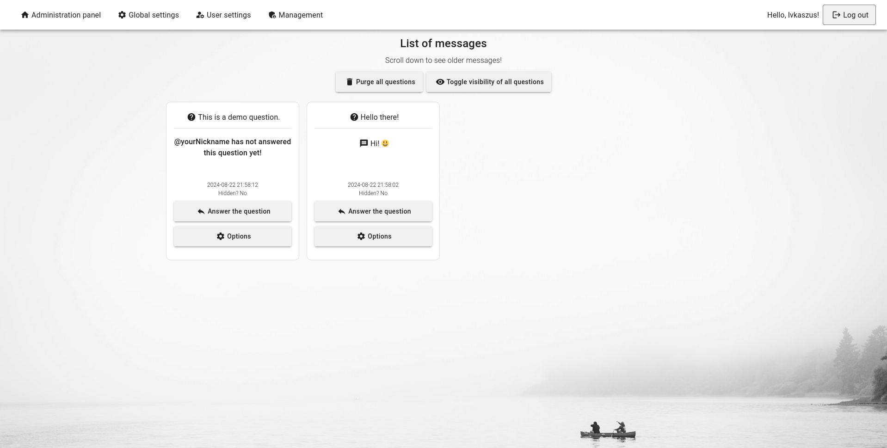

<h1>Ask @lvkaszus!</h1>
<h3>Anonymous questions and answers application, pretty much like Ngl or Tellonym, but better!</h3>

|   |   |
|-----------------------------------------|------------------------------------------|
|  |  |

<h2>Why this was created?</h2>

I pretty much like the conception of NGL App or Tellonym, but I didn't like overall application operation. So, I created my own alternative to them with some added features and no analytics inside source code.

<h2 align="center">Features</h2>

- Receiving anonymous questions from people that have sent a message on main page with notifications (by using Telegram Bot API Integration or Push Notifications)
- Replying to anonymous questions with use of Markdown formatting system that not only can **format** ~~text~~ but also embed an YouTube video or OpenStreetMap geolocation
- Show/Hide all questions with a single click
- Manually show/hide single question
- Multiple Sender Blocking based on sender's IP address blacklisting in one of the database tables (IP Addresses of Users around the internet are public after all, so sender's anonymity/privacy has not been lost!)
- **If enabled by Administrator**: Protected Administrator REST API
- **If enabled by Administrator**: Public User REST API
- Secure authorization/authentication system
- SQL Injection / XSS / CSRF Protection
- Completely refreshed User Interface
- Integrated Backend Tools for recovering/changing administrator password, deleting administrator account or for restoring factory default application settings
- Rate-limiting to prevent abusive actions
- Application update alerts

<h2 align="center">Comparison</h2>

|                                       | Ask @lvkaszus!             | Tellonym                   | Ngl App                  |
|---------------------------------------|----------------------------|----------------------------|--------------------------|
| **Open Source?**                      | ✅ Yes                     | ❌ No                      | ❌ No                     |
| **Data Tracking?**                    | ✅ No                      | ❌ Yes                     | ❌ Yes                    |
| **Ads?**                              | ✅ No Ads                  | ❌ Ads                     | ❌ Ads                    |
| **Automatic Bot Questions?**              | ✅ No Automatic Bot Questions  | ❌ Yes                     | ❌ Yes                    |
| **Text Formatting & Custom Media?**                  | ✅ Yes (including videos and locations) | ⚠️ Limited to Photos Only | ⚠️ Limited to Photos Only in Background |
| **Notifications?**                    | ✅ Yes (PWA, Telegram)     | ✅ Yes                     | ✅ Yes                    |
| **Available On?**                     | ✅ Desktop and Mobile (PWA) | ✅ Desktop and Mobile      | ⚠️ Mobile Only            |

<h2>Installation</h2>

If you want to give this project a try and install it on your server, then please visit

[Full installation guide available here](documentation/Installation/Installation.md)!

Application is available to install in Docker image or if you don't want to install it with using Docker, you can also install it manually step-by-step as described in the guide linked above.

<h2>Documentation</h2>

Entire documentation for this project is inside the `documentation` directory in the root path of this project repository.

[Full documentation available here](documentation/Main.md)!

<h2>Contributions</h2>

Project is fully open for contributions! 😁️

Several steps you MUST do when want to contribute:

- Fork this repository: https://github.com/lvkaszus/asklvkaszus/fork
- Clone your forked repository: `git clone https://github.com/<USERNAME>/<REPOSITORY_NAME>`
- Make your desired changes to the code.
- Create new branch with your new feature that you want to apply: `git checkout -b <NEW_FEATURE_NAME>`
- Apply your changes: `git add .`
- Commit your changes: `git commit -m "<NEW_FEATURE_DESCRIPTION>"`
- Push your changes to your forked repository: `git push origin <NEW_FEATURE_NAME>`
- Create a new pull request with it's changes description.

And next, i will check and test your pull request. If eveything will be good, i will merge it. When there be any problems, i will notify you about them.

