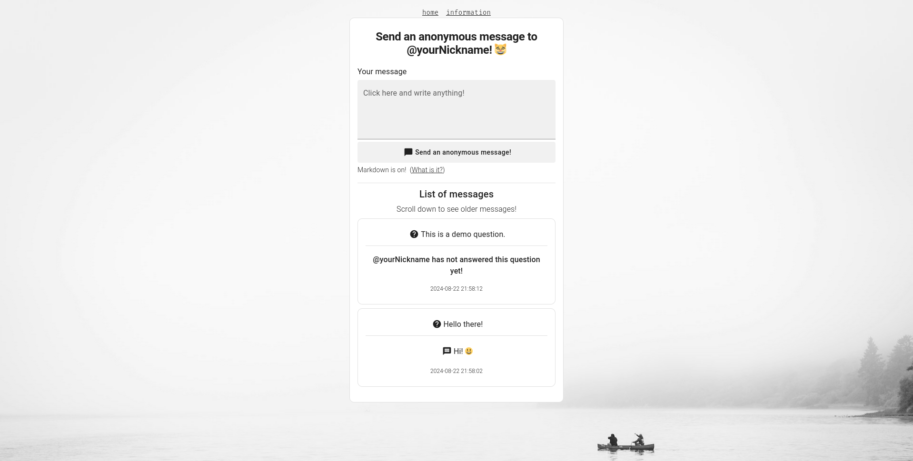

<h1>Ask @lvkaszus!</h1>
<h3>Anonymous questions and answers application, pretty much like Ngl or Tellonym, but better!</h3>

|   |   |
|-----------------------------------------|------------------------------------------|
|  |  |

<h2>Why this was created?</h2>

I pretty much like the conception of NGL App or Tellonym, but I didn't like overall application operation. So, I created my own alternative to them with some added features and no analytics inside source code.

<h2 align="center">Features</h2>

- Receiving anonymous questions from people that have sent a message on main page with notifications (by using Telegram Bot API Integration)
- Replying to anonymous questions with use of Markdown formatting system that not only can **format** ~~text~~ but also embed an YouTube video or OpenStreetMap geolocation
- Show/Hide all questions with a single click
- Manually show/hide single question
- Multiple Sender Blocking based on sender's IP address blacklisting in one of the database tables (IP Addresses of Users around the internet are public after all, so sender's anonymity/privacy has not been lost!)
- Protected Administrator REST API
- Public User REST API
- Secure authorization/authentication system
- SQL Injection / XSS / CSRF Protection
- Completely refreshed User Interface
- Integrated Backend Tools for recovering/changing administrator password, deleting administrator account or for restoring factory default application settings
- Rate-limiting to prevent abusive actions
- Application update alerts

<h2 align="center">Comparison</h2>

|                                       | Ask @lvkaszus!       | Tellonym               | Ngl App             |
|---------------------------------------|----------------------|------------------------|---------------------|
| **Open Source?**                      | ✅ Open Source       | ❌ Open Source         | ❌ Open Source      |
| **Data Tracking?**                    | ✅ No data tracking  | ❌ No data tracking    | ❌ No data tracking |
| **Ads?**                              | ✅ Ad-free           | ❌ Ad-free             | ❌ Ad-free          |
| **Automatic Questions?**              | ✅ Does not send annoying automatic questions | ❌ Does not send annoying automatic questions | ❌ Does not send annoying automatic questions |
| **Text Formatting?**                  | ✅ Offers text formatting (as well as placing videos or location inside questions/answers!) | ⚠️ Only offers placing photos | ⚠️ Only offers placing photos in the background |
| **Notifications?**                    | ✅ Notifications (by Telegram) | ✅ Notifications | ✅ Notifications |
| **Available On?**                     | ✅ Desktop and Mobile (PWA) | ✅ Desktop and Mobile | ⚠️ Only on Mobile |

<h2>Installation</h2>

If you want to give this project a try and install it on your server, then please visit

[Full installation guide available here](documentation/Installation.md)!

Application is available to install in Docker image or if you don't want to install it with using Docker, you can also install it manually step-by-step as described in the guide linked above.

<h2>Documentation</h2>

Entire documentation for this project is inside the `documentation` directory in the root path of this project repository.

[Full documentation available here](documentation/Main.md)!

<h2>Contributions</h2>

Project is fully open for contributions! 😁️

Several steps you MUST do when want to contribute:

- Fork this repository: https://github.com/lvkaszus/asklvkaszus/fork
- Clone your forked repository: `git clone https://github.com/<USERNAME>/<REPOSITORY_NAME>`
- Make your desired changes to the code.
- Create new branch with your new feature that you want to apply: `git checkout -b <NEW_FEATURE_NAME>`
- Apply your changes: `git add .`
- Commit your changes: `git commit -m "<NEW_FEATURE_DESCRIPTION>"`
- Push your changes to your forked repository: `git push origin <NEW_FEATURE_NAME>`
- Create a new pull request with it's changes description.

And next, i will check and test your pull request. If eveything will be good, i will merge it. When there be any problems, i will notify you about them.

